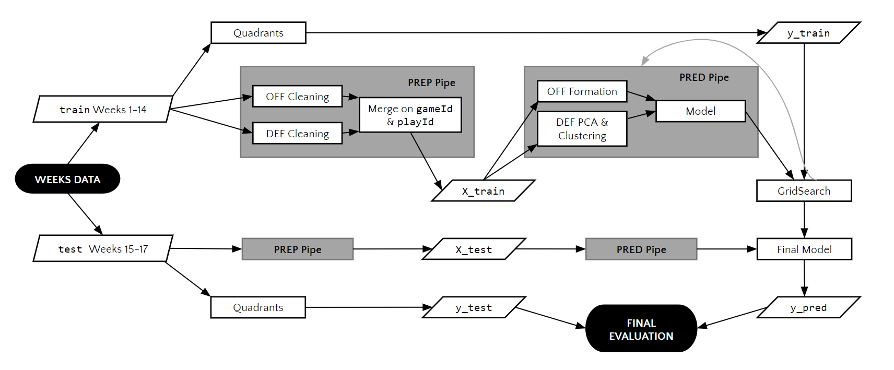

# NFL Big Data Bowl Pass Prediction

Following is a brief starting guide to replicating our work on predicting NFL passing quadrants based on offensive and defensive play and positional data. 

## Getting Started

### Clone the repo
First, to download the repo use the following command in Terminal: `git clone https://github.com/andrewbakert/NFL_Pass_Pred.git`

### Install required packages
Next, to download the requisite packages and versions run the following: `pip install -r requirements.txt`

### Download required data
We have provided a python script to download the required data from Kaggle and combine the week-by-week positional data into one dataframe. This file is located in [this script](get_data.py).

In order to download the data, run the following commands from that file:

`get_assets()` retrieves all data from Kaggle and stores the files in a folder named `Kaggle-Data-Files`.

`get_positional_data()` combines all of the week-by-week positional data into one dataframe. The positional data is given in x and y coordinates, and these coordinates are aligned with the field based on the diagram shown below.

## Visualizations
We also created several functions that can be used to visualize the positions of players on specific plays. One function creates a chart with starting positions for each player. A second function can be used to create an interactive chart with positions of each player at various time intervals that are averaged as quantile cuts. The process to create a starting diagram is shown below. The functions are in [play_vis.py](play_vis.py).
1) `positions = get_positional_data()`
2) `create_starting_chart(positions, gameId, playId)` The gameId and playId are integer representations of game and play IDs from the positional dataframe columns of the same names.

An example of an output of this function is shown below. Note that the x and y coordinate directions are reversed from the full field chart.

## Data Cleaning
We separated data cleaning into cleaning for the offensive side and defensive side.

### Offensive Cleaning
The function used for offensive data cleaning is in [form_pred.py](form_pred.py). This function creates several features, specifically the starting positions of each offensive players, with null values where a position is not being used in a play. These nulls were filled with 0. The steps to process offensive data are shown below:
1) `positions = get_positional_data()`
2) `off_clean = clean_positional(positions)` There are several optional parameters for this function. `first` indicates the first week processed, `last` indicates the last week processed, and `yards_behind_line` indicates the number of yards used as the basis to flag whether players are far behind the line of scrimmage.

### Defensive Cleaning
The class used to process defensive data is available in [def_clean.py](def_clean.py). This class creates several features and returns additional features containing labels for each player by, with the options of blitz(`B`), zone(`Z`), or man(`M`) coverage. The code needed to generate these features are shown below:

`def_clean = DefensiveCleaning()` With default parameters, this will initialize the positional data and set attributes for all required data. Another attribute is `n_cuts`, which specifies the number of quantile cuts to group the positional data into in order to reduce dimensions.

`def_clean_df = def_clean.generate_full_df(1, 17)`. The first input is the first week processed, and the second is the last week processed.

## Pipeline Pre-Processing

### Ball Quadrants
In order to create a Y variable, we first processed data on where the ball was thrown. We separated the defensive side of the field into 16 quadrants, including 4 in the x direction and 4 in the y direction. The placement of the quadrants was dependent on the distance laterally from the quarterback and space downfield. [ball_movement.py](ball_movement.py) contains the function used for this purpose. An example of implementation is shown below:

`positions = get_positional_data()`

`quads = ball_quadrants(positions)` There is an optional paramters, `y_sections`, which indicates the number of y position buckets used for quadrant creation.

### Splitting the Data
Once we created the processed offensive data, the processed defensive data, and the quadrants, we created a function to split this data into train and test sets. This function is available in [TrainTestNFL.py](TrainTestNFL.py). An implementation of this function given the processed data and quadrants is shown below:

`train_test = TrainTestNFL(off_clean, def_clean_df, quads)` These parameters match the outputs of the offensive processing, defensive processing, and quadrant creation, respectively.

`X_train, X_test, y_train, y_test = train_test.split(1, 14)`. The two parameters bound the size of the train and test set. In this case, the training set contains data from week 1 to 14, and the test set contains data from week 15 to week 17.

## Pipeline
Shown below is a visualization of the full pipeline used after processing the offensive and defensive data. We created several classes to streamline data preparation and processing. These classes are contained in [pipeline.py](pipeline.py). The classes in this script were intended to be a replacement for coding several processing steps when training. 

### Data Preparation
The first class, `PrepPipe`, was created to pre-processess data and split the data. This class relies on the defensive processing class, the offensive processing function, the ball quadrant creation function, and the data splitting function.

### Offensive Pip
